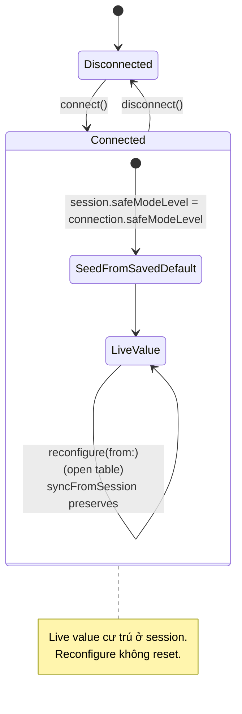
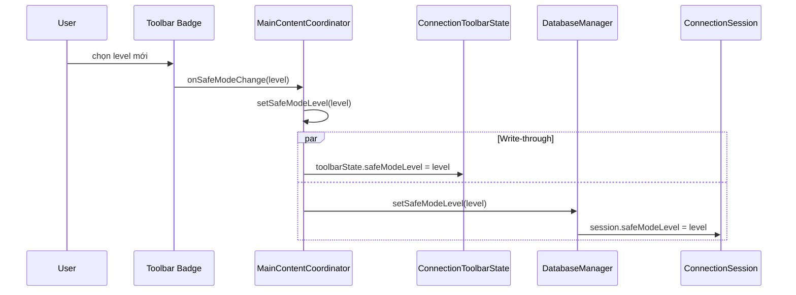
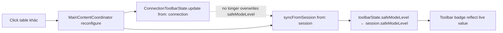
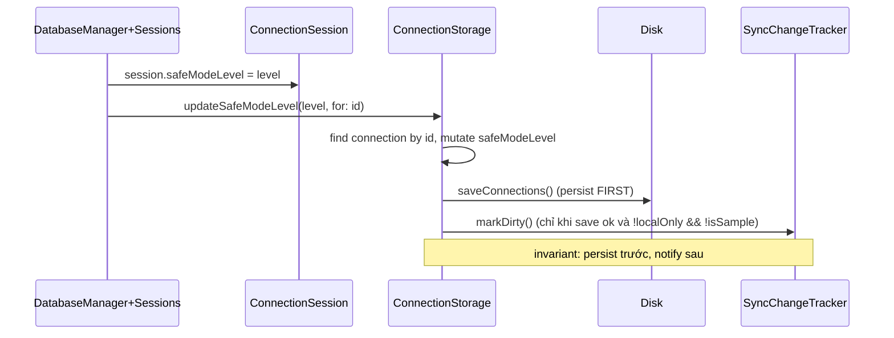

# connections — flow

## Safe Mode lifecycle (sau #1376)

```mermaid
stateDiagram-v2
  [*] --> Disconnected
  Disconnected --> Connected: connect()
  state Connected {
    [*] --> SeedFromSavedDefault: session.safeModeLevel = connection.safeModeLevel
    SeedFromSavedDefault --> LiveValue
    LiveValue --> LiveValue: user thay đổi badge<br/>setSafeModeLevel()<br/>= toolbarState + session
    LiveValue --> LiveValue: reconfigure(from:)<br/>(open table)<br/>syncFromSession preserves
  }
  Connected --> Disconnected: disconnect()
  note right of Connected
    Live value cư trú ở session.
    Reconfigure không reset.
  end note
```

## setSafeModeLevel: write-through

```mermaid
sequenceDiagram
  participant U as User
  participant Tb as Toolbar Badge
  participant Coord as MainContentCoordinator
  participant Ts as ConnectionToolbarState
  participant Db as DatabaseManager
  participant S as ConnectionSession

  U->>Tb: chọn level mới
  Tb->>Coord: onSafeModeChange(level)
  Coord->>Coord: setSafeModeLevel(level)
  par Write-through
    Coord->>Ts: toolbarState.safeModeLevel = level
  and
    Coord->>Db: setSafeModeLevel(level)
    Db->>S: session.safeModeLevel = level
  end
```

## Reconfigure path (sau #1376)

```mermaid
flowchart LR
  A[Click table khác] --> B[MainContentCoordinator reconfigure]
  B --> C[ConnectionToolbarState.update from: connection]
  C -.no longer overwrites safeModeLevel.-> D
  B --> D[syncFromSession from: session]
  D --> E[toolbarState.safeModeLevel ← session.safeModeLevel]
  E --> F[Toolbar badge reflect live value]
```

## Auto-save persist path (PR #1461, open)

```mermaid
sequenceDiagram
  participant Db as DatabaseManager+Sessions
  participant S as ConnectionSession
  participant CS as ConnectionStorage
  participant Disk as Disk
  participant Sync as SyncChangeTracker

  Db->>S: session.safeModeLevel = level
  Db->>CS: updateSafeModeLevel(level, for: id)
  CS->>CS: find connection by id, mutate safeModeLevel
  CS->>Disk: saveConnections()  (persist FIRST)
  CS->>Sync: markDirty()  (chỉ khi save ok và !localOnly && !isSample)
  Note over CS,Sync: invariant: persist trước, notify sau
```
