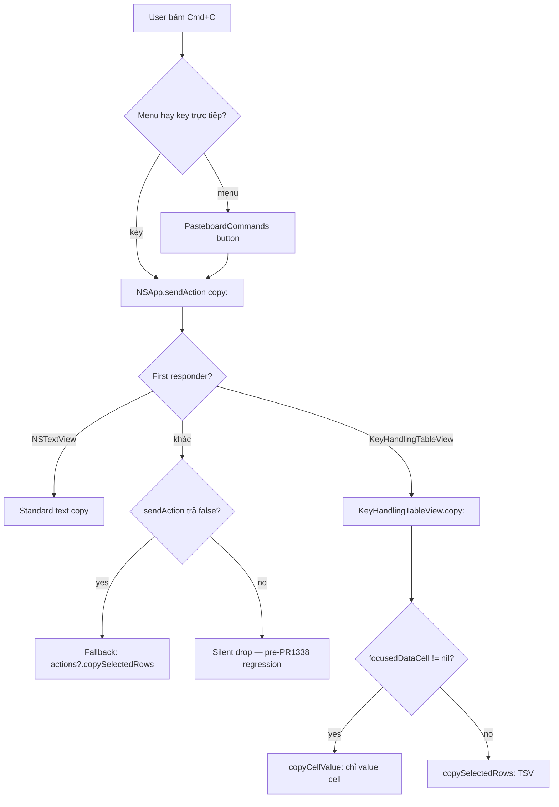
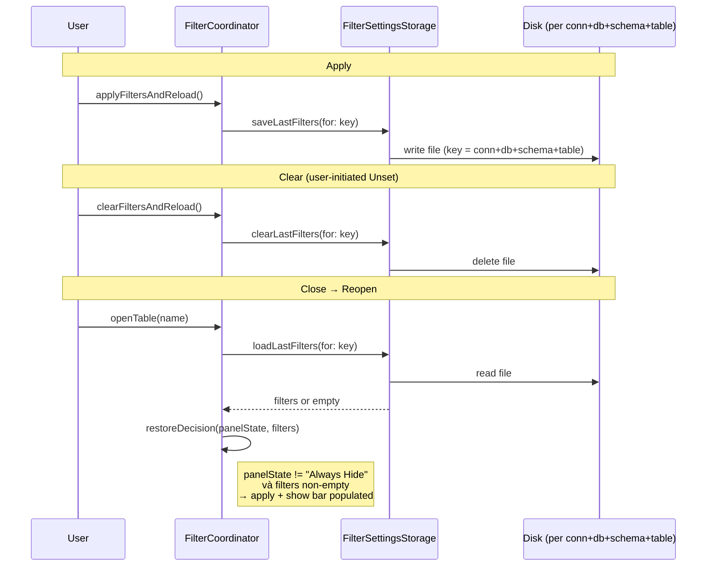
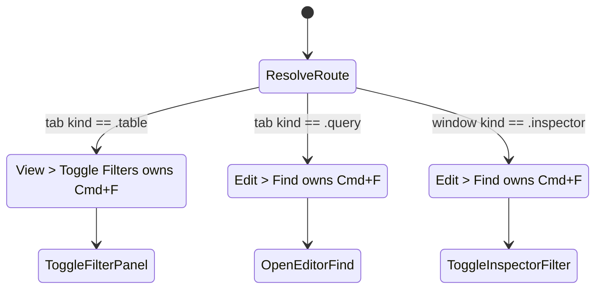
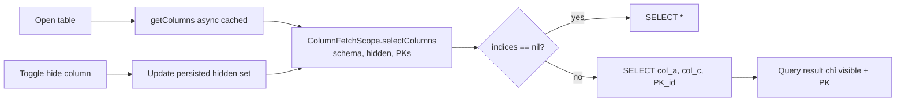
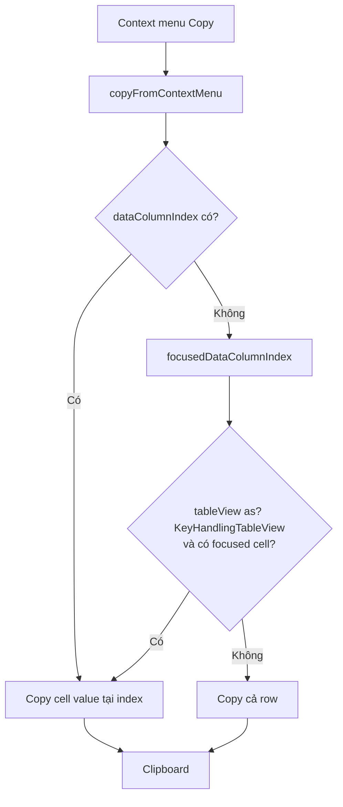

# datagrid — flow

## Cmd+C dispatch (sau #1337, #1338)

## Filter persistence lifecycle (sau #1387, #1395)

## Cmd+F context routing (sau #1360)

## Hidden column → query scope (sau #1375)

## Context menu Copy cell vs row (PR #1459, open)

