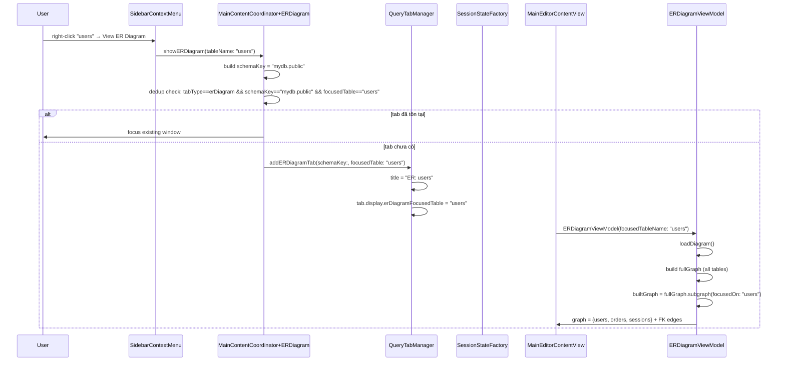
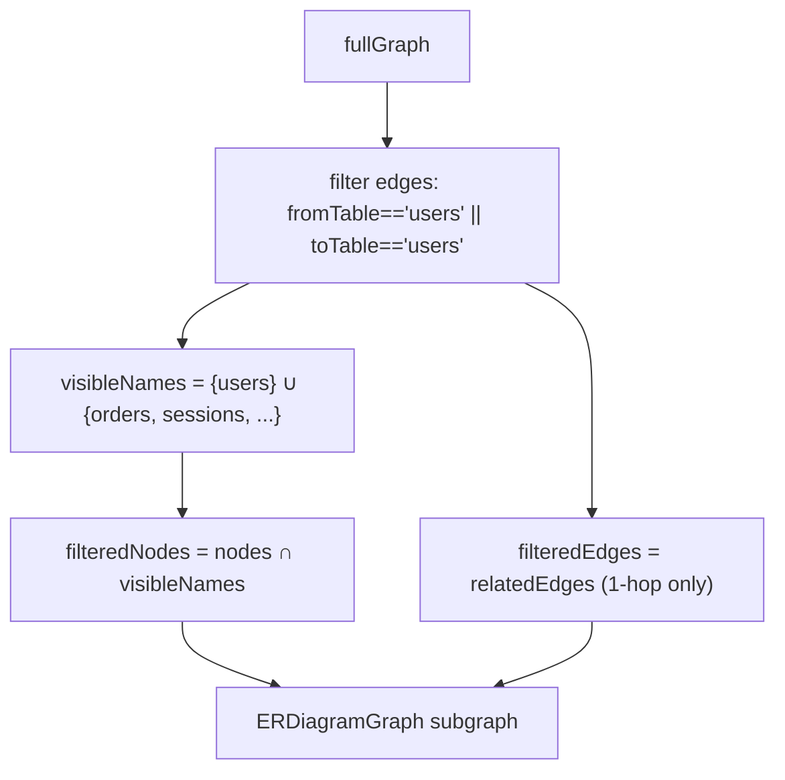

# Flow

## Trigger Flow: Sidebar Right-Click → Focused ER Diagram

## subgraph(focusedOn:) Logic

## Tab Lifecycle & Persistence

```mermaid
flowchart LR
    A[showERDiagram tableName] --> B[EditorTabPayload\nerDiagramFocusedTable]
    B --> C[WindowManager.openTab]
    C --> D[SessionStateFactory\naddERDiagramTab focusedTable]
    D --> E[QueryTab\ndisplay.erDiagramFocusedTable]
    E --> F[toPersistedTab\nerDiagramFocusedTable]
    F --> G[disk JSON]
    G --> H[restore: PersistedTab\nerDiagramFocusedTable]
    H --> I[QueryTab init\nTabDisplayState]
    I --> J[MainEditorContentView\nERDiagramViewModel focusedTableName]
```

## Key File Mapping

| Concern | File |
|---|---|
| Entry point (sidebar) | `Views/Sidebar/SidebarContextMenu.swift` |
| Entry point (menu bar) | `TableProApp.swift:583` |
| Coordinator / dedup | `Views/Main/Extensions/MainContentCoordinator+ERDiagram.swift` |
| Tab creation | `Models/Query/QueryTabManager.swift` |
| Tab state | `Models/Query/QueryTabState.swift` (PersistedTab, TabDisplayState) |
| Tab restore | `Core/Services/Infrastructure/SessionStateFactory.swift` |
| VM init / filter | `ViewModels/ERDiagramViewModel.swift` |
| Graph model + filter | `Models/ERDiagram/ERDiagramModels.swift` |
| View init | `Views/Main/Child/MainEditorContentView.swift` |
