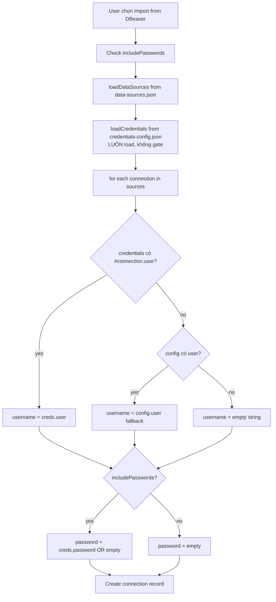
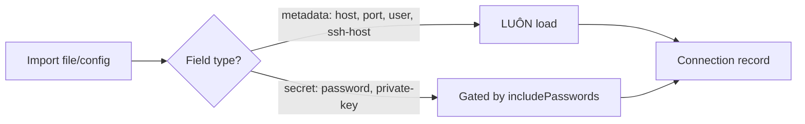

# import — flow

## DBeaver import (sau #1366)



## DBeaver storage layout

```mermaid
flowchart LR
  subgraph DBeaver 6.1.3+
    A1[data-sources.json] -->|host, port, ssh, ssl| C1[Connection metadata]
    A2[credentials-config.json] -->|username, password| C2[Auth secrets]
    A2 -.encrypted on disk.-> A2
  end
  subgraph DBeaver < 6.1.3 hoặc admin config
    B1[data-sources.json] -->|host, port, user| D1[Combined]
  end
  C1 --> Z[TablePro import]
  C2 --> Z
  D1 --> Z
```

## Metadata vs Secret split


