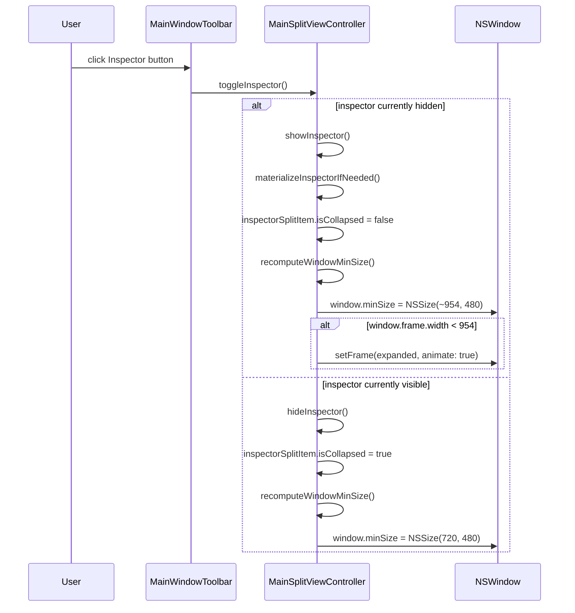
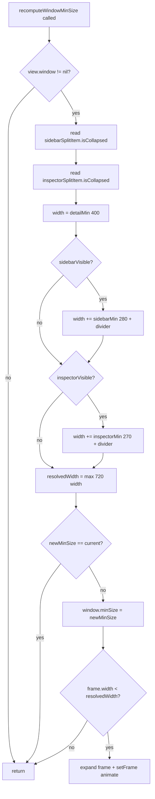
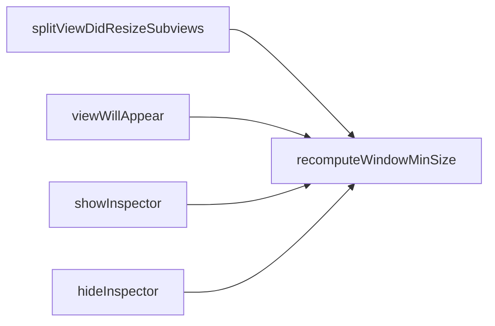
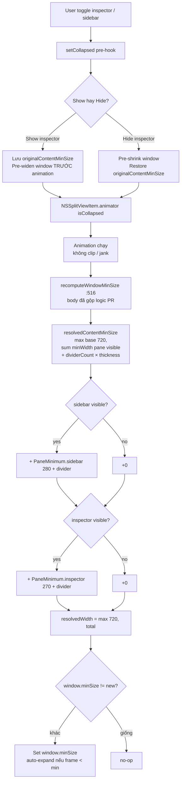
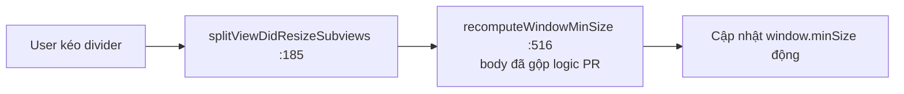

# Inspector pane overflow — flow

> **Reconcile 2026-06-09.** Các diagram bên dưới mô tả luồng `recomputeWindowMinSize` (cách CŨ) và
> "merged sizing flow" (kế hoạch GỘP). PR đã pivot sang `collapseBehavior` (commit `58cd1102`), bỏ
> hết recompute → các diagram đó **superseded**. Luồng thực tế hiện tại:
>
> ```mermaid
> flowchart TD
>     A[Setup: inspectorSplitItem.collapseBehavior<br/>= .preferResizingSplitViewWithFixedSiblings] --> B[User toggle inspector]
>     B --> C[showInspector / hideInspector]
>     C --> D[setCollapsed _:for_:<br/>animate isCollapsed CHỈ khi window.isVisible]
>     D --> E[AppKit tự nới/thu window<br/>để fit, không ép detail pane]
>     E --> F[Floor 720×480 tĩnh từ TabWindowController:75]
> ```

## Luồng toggle inspector



## Luồng recompute minSize



## 4 call sites



## Key file mapping (VERIFIED-2026-05-30 vs main)

| Symbol | File | Line |
|---|---|---|
| `recomputeWindowMinSize()` (def) | `MainSplitViewController.swift` | `:516` |
| call: `splitViewDidResizeSubviews` | `MainSplitViewController.swift` | `:185` (override `:183`) |
| call: `viewWillAppear` | `MainSplitViewController.swift` | `:217` (override `:194`) |
| call: `showInspector()` | `MainSplitViewController.swift` | `:478` (func `:474`) |
| call: `hideInspector()` | `MainSplitViewController.swift` | `:484` (func `:481`) |
| `window.minSize` baseline (720×480) | `TabWindowController.swift` | ~`:54` |

> Superseded 2026-05-30: bảng cũ (~502/460/467/167/178) là ước lượng; số trên đã verify trên main.

## Open fork PR #1463 — merged sizing flow (sau khi gộp vào `recomputeWindowMinSize()`)

> PR thêm `PaneMinimum` / `resolvedContentMinSize` / `originalContentMinSize` /
> `setCollapsed` pre-hook. Logic gộp VÀO `recomputeWindowMinSize()` `:516` (không
> tạo `recomputeWindowMinimumSize()` trùng). Override `splitViewDidResizeSubviews`
> `:183` tự pick up logic mới.




