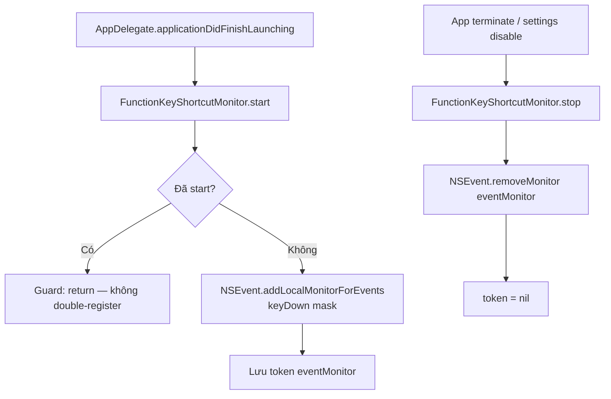
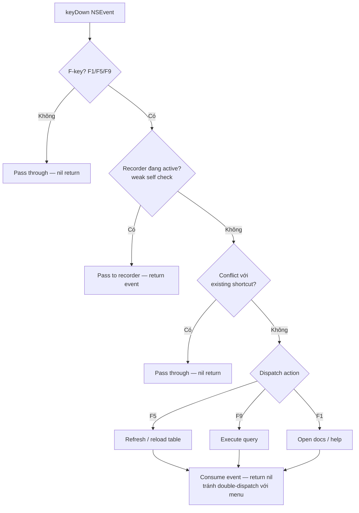
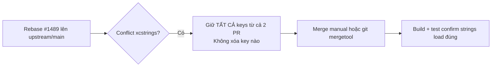

# Flow — `keyboard/` NSEvent monitor + F-key dispatch (PR #1489)

## Monitor lifecycle

```mermaid
flowchart TD
    A[AppDelegate.applicationDidFinishLaunching] --> B[FunctionKeyShortcutMonitor.start]
    B --> C{Đã start?}
    C -->|Có| D[Guard: return — không double-register]
    C -->|Không| E[NSEvent.addLocalMonitorForEvents\nkeyDown mask]
    E --> F[Lưu token eventMonitor]

    G[App terminate / settings disable] --> H[FunctionKeyShortcutMonitor.stop]
    H --> I[NSEvent.removeMonitor eventMonitor]
    I --> J[token = nil]
```

## F-key dispatch flow

```mermaid
flowchart TD
    A[keyDown NSEvent] --> B{F-key? F1/F5/F9}
    B -->|Không| C[Pass through — nil return]
    B -->|Có| D{Recorder đang active?\nweak self check}
    D -->|Có| E[Pass to recorder — return event]
    D -->|Không| F{Conflict với\nexisting shortcut?}
    F -->|Có| G[Pass through — nil return]
    F -->|Không| H{Dispatch action}
    H -->|F5| I[Refresh / reload table]
    H -->|F9| J[Execute query]
    H -->|F1| K[Open docs / help]
    I --> L[Consume event — return nil\ntránh double-dispatch với menu]
    J --> L
    K --> L
```

## Conflict resolution `Localizable.xcstrings`

```mermaid
flowchart LR
    A[Rebase #1489 lên upstream/main] --> B{Conflict xcstrings?}
    B -->|Có| C[Giữ TẤT CẢ keys từ cả 2 PR\nKhông xóa key nào]
    C --> D[Merge manual hoặc git mergetool]
    D --> E[Build + test confirm strings load đúng]
```
