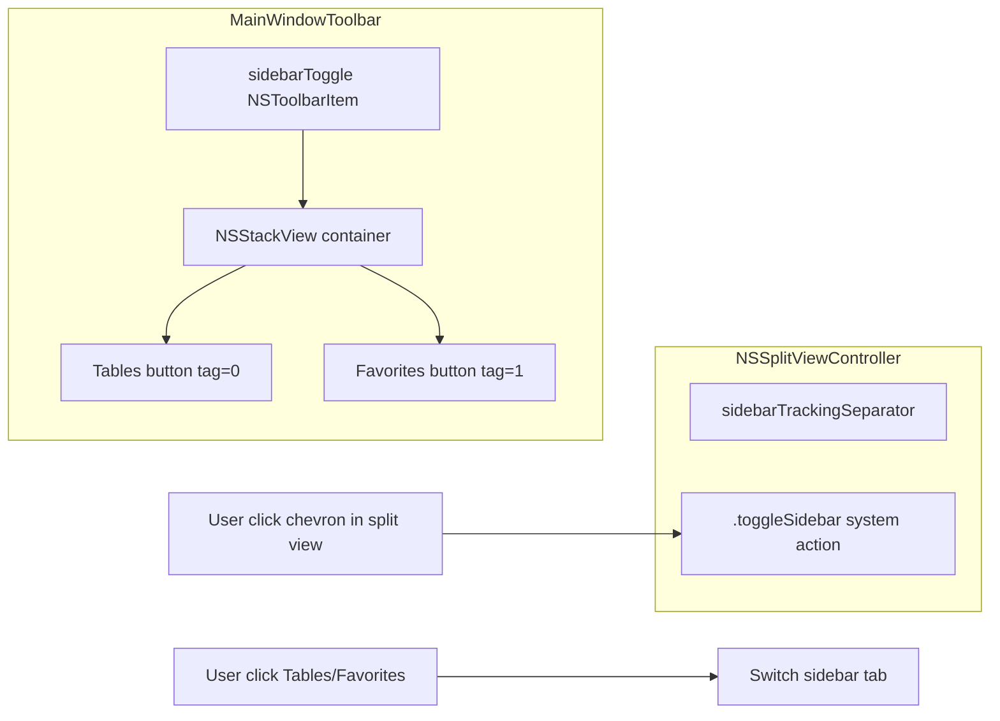
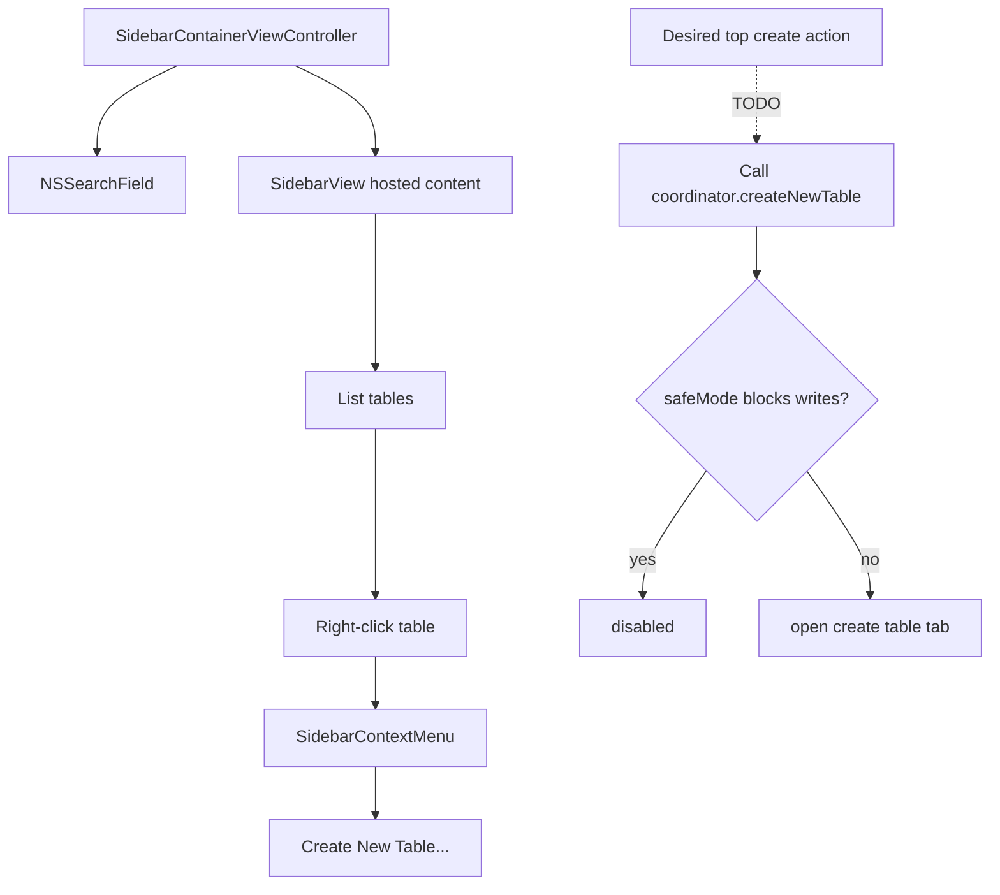
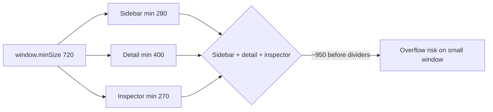
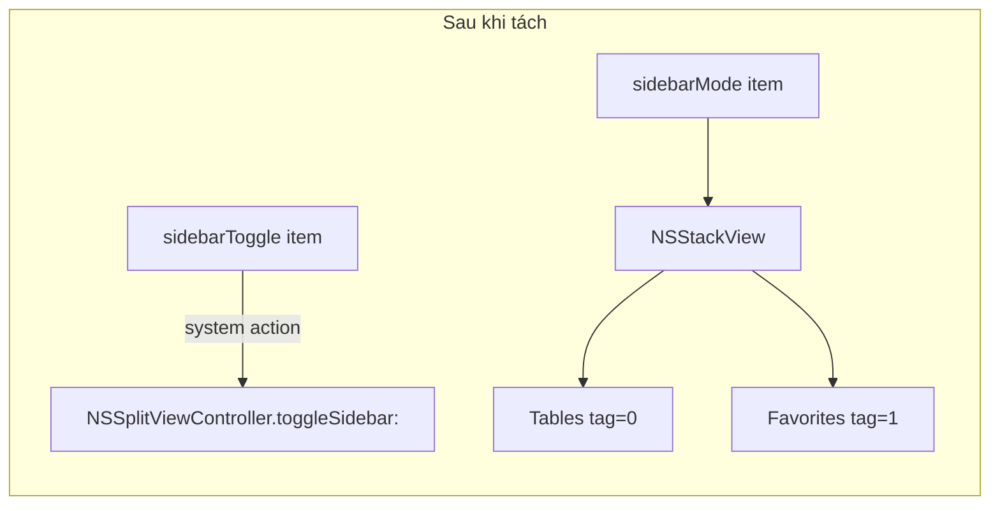
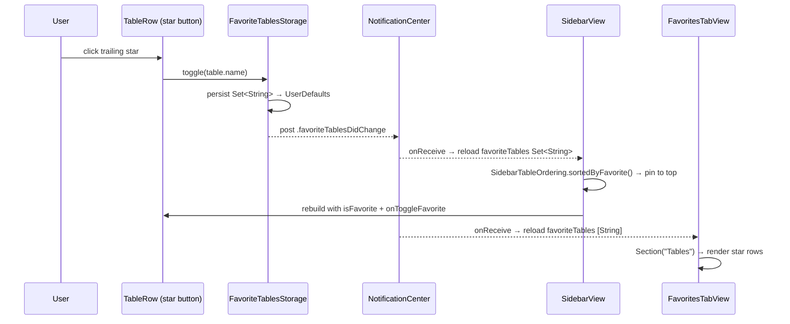
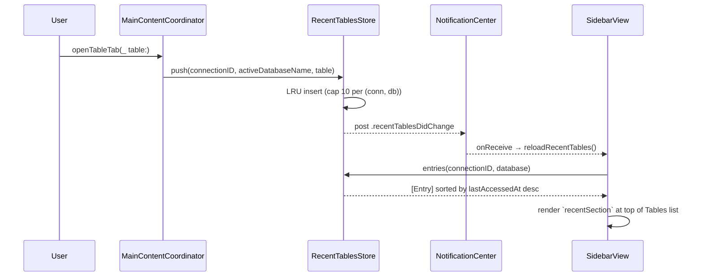
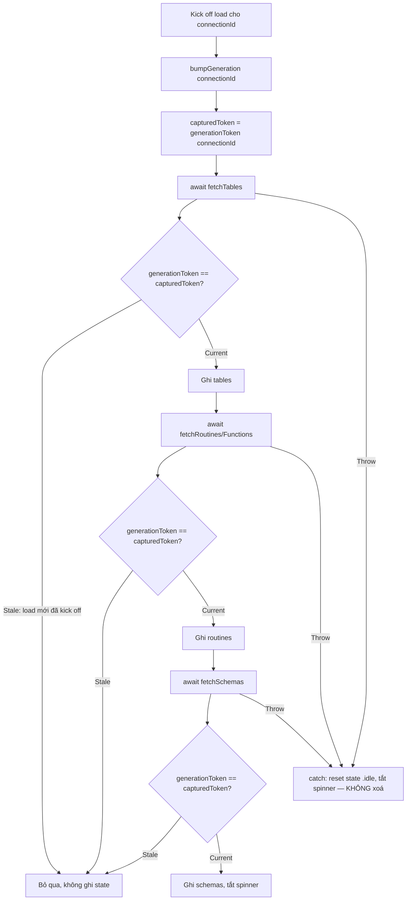
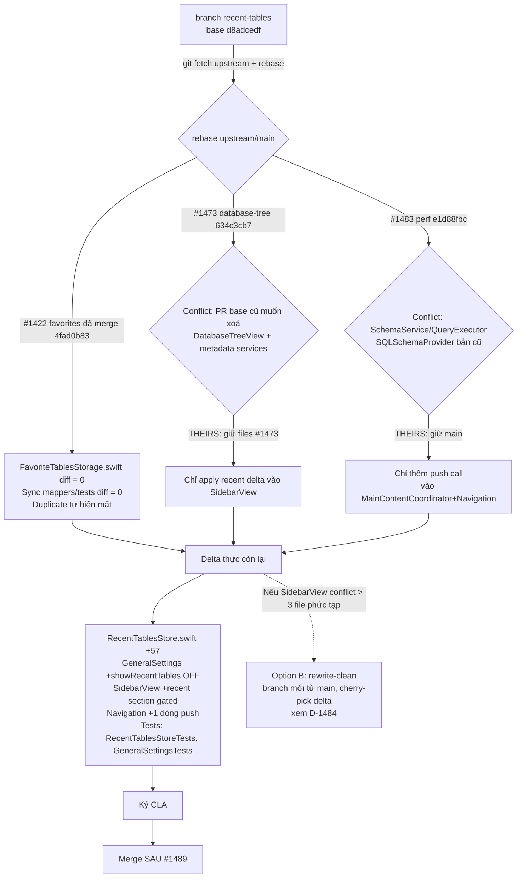

# sidebar — flow

## Combined control hiện tại (#1353 → VERIFY-current)

User nhìn 3 thứ trên 1 hàng → 3 control khác nhau:
1. Tables/Favorites tab switch (trong `sidebarToggle` item)
2. Collapse/expand sidebar chevron (do NSSplitViewController)
3. Tracking separator

→ Confusing.

User checklist 2026-05-25 mark item này xong, nhưng source vẫn như diagram trên.
Cần verify UI runtime trước khi đổi docs thành DONE.

## Local checklist TODO flows

## Đề xuất tách (nếu fork re-implement)

## Favorite tables — current flow (commit `408d1589` + session sidebar-recents-star)

Star button trạng thái: `star.fill` (yellow) nếu favorite, `star` (secondary opacity 55%) nếu không.

Context menu **không còn** Add/Remove Favorites — star button là path duy nhất.

## Recent tables — current flow

Storage: in-memory `@MainActor` singleton (`RecentTablesStore.shared`); clears on quit. Key = `(connectionID: UUID, database: String)`. Schema stored in `Entry`, not key (xem [D14](decisions.md#d14-recent-tables--connectionid-database-key-not-include-schema)).

Render site: `SidebarView.recentSection` rendered **trước** `ForEach(SidebarObjectKind.allCases)`. Hidden khi `filteredRecents.isEmpty`. Expand state qua `SidebarViewModel.isRecentsExpanded` (default `true`, not persisted).

Recent rows tag bằng `TableInfo`. Vì `TableInfo` Equality bỏ qua `rowCount`, selection của recent row đồng nhất với row trong section chính.

## Open PR #1460 — generation-guard flow (reuse `generations` sẵn có)

> Fix dùng `generationToken(for:)`/`bumpGeneration()` đã có trên main (`SchemaService.swift:21-28`), KHÔNG thêm dict thứ 2.

Catch-block luôn reset `.idle` bất kể generation → spinner không bao giờ kẹt khi lỗi (root cause của stuck spinner).

## Open PR #1484 — rebase-deconflict flow

