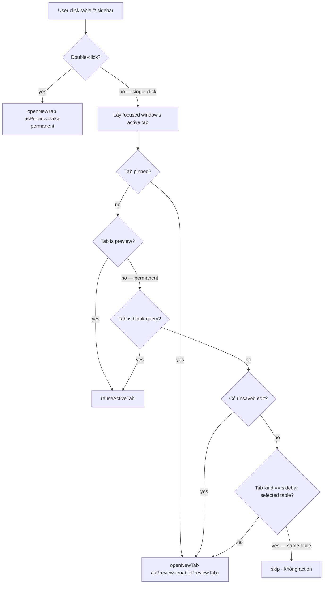
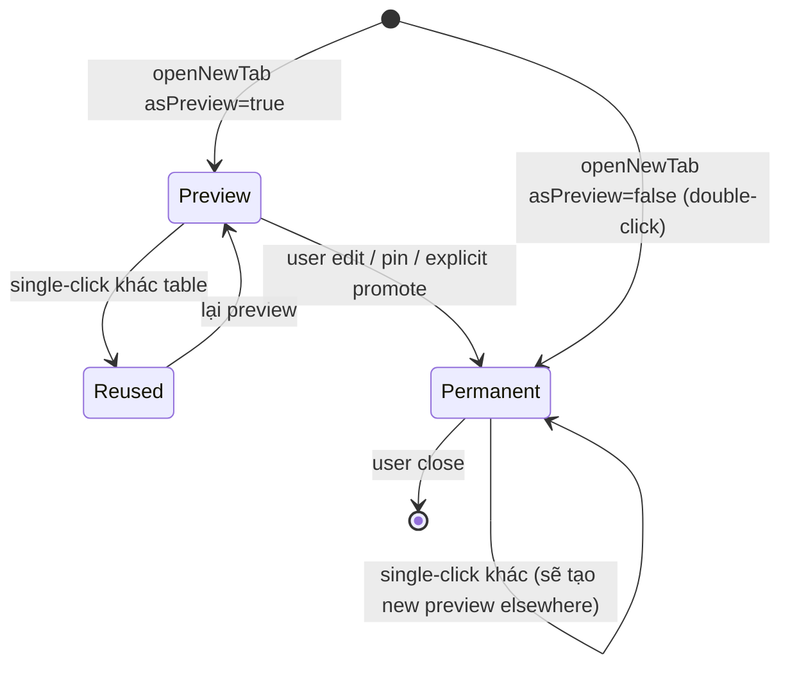
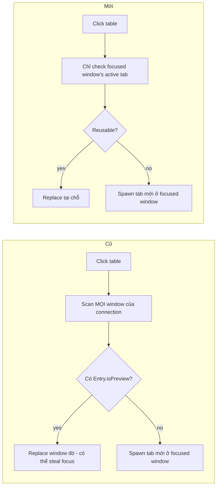

# tabs — flow

## Tab reuse decision (sau #1394)

```mermaid
flowchart TD
  A[User click table ở sidebar] --> B{Double-click?}
  B -->|yes| Z[openNewTab asPreview=false<br/>permanent]
  B -->|no — single click| C[Lấy focused window's active tab]
  C --> D{Tab pinned?}
  D -->|yes| Y[openNewTab asPreview=enablePreviewTabs]
  D -->|no| E{Tab is preview?}
  E -->|yes| R[reuseActiveTab]
  E -->|no — permanent| F{Tab is blank query?}
  F -->|yes| R
  F -->|no| G{Có unsaved edit?}
  G -->|yes| Y
  G -->|no| H{Tab kind == sidebar selected table?}
  H -->|yes — same table| S[skip - không action]
  H -->|no| Y
```

## State machine: preview ↔ permanent

```mermaid
stateDiagram-v2
  [*] --> Preview: openNewTab asPreview=true
  Preview --> Reused: single-click khác table
  Reused --> Preview: lại preview
  Preview --> Permanent: user edit / pin / explicit promote
  Permanent --> Permanent: single-click khác (sẽ tạo new preview elsewhere)
  Permanent --> [*]: user close
  [*] --> Permanent: openNewTab asPreview=false (double-click)
```

## Trước vs sau

```mermaid
flowchart LR
  subgraph Cũ
    A1[Click table] --> B1[Scan MỌI window của connection]
    B1 --> C1{Có Entry.isPreview?}
    C1 -->|yes| D1[Replace window đó - có thể steal focus]
    C1 -->|no| E1[Spawn tab mới ở focused window]
  end
  subgraph Mới
    A2[Click table] --> B2[Chỉ check focused window's active tab]
    B2 --> C2{Reusable?}
    C2 -->|yes| D2[Replace tại chỗ]
    C2 -->|no| E2[Spawn tab mới ở focused window]
  end
```
