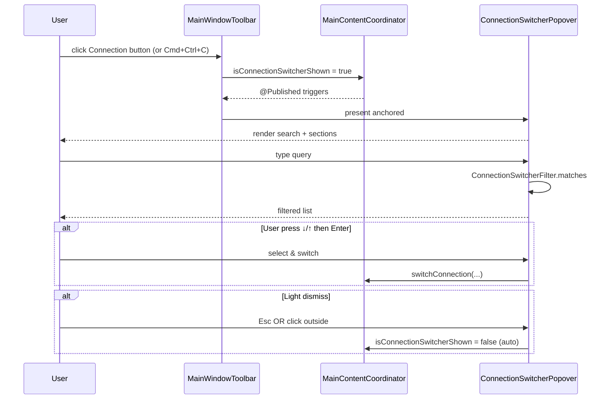
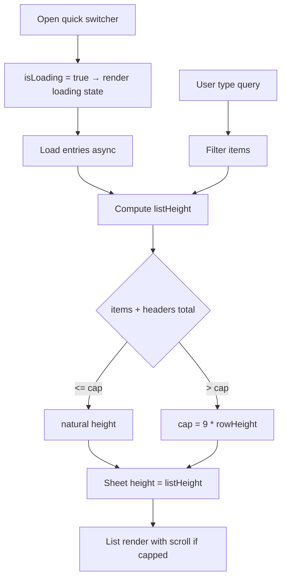
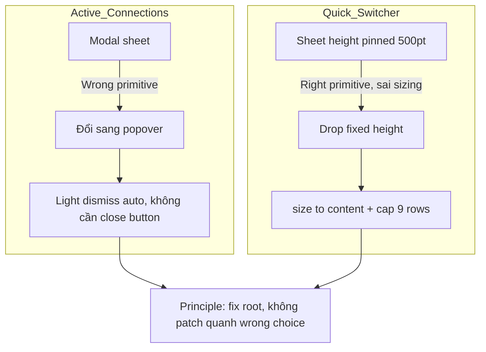

# toolbar — flow

## Active Connections: sheet → popover migration (sau #1386)

```mermaid
sequenceDiagram
  participant User
  participant Toolbar as MainWindowToolbar
  participant Coord as MainContentCoordinator
  participant Popover as ConnectionSwitcherPopover

  User->>Toolbar: click Connection button (or Cmd+Ctrl+C)
  Toolbar->>Coord: isConnectionSwitcherShown = true
  Coord-->>Toolbar: @Published triggers
  Toolbar->>Popover: present anchored
  Popover-->>User: render search + sections

  User->>Popover: type query
  Popover->>Popover: ConnectionSwitcherFilter.matches
  Popover-->>User: filtered list

  alt User press ↓/↑ then Enter
    User->>Popover: select & switch
    Popover->>Coord: switchConnection(...)
  end

  alt Light dismiss
    User->>Popover: Esc OR click outside
    Popover->>Coord: isConnectionSwitcherShown = false (auto)
  end
```

## Quick switcher: size-to-content cap (sau #1392)

```mermaid
flowchart TD
  A[Open quick switcher] --> B[isLoading = true → render loading state]
  B --> C[Load entries async]
  C --> D[Compute listHeight]
  D --> E{items + headers total}
  E -->|<= cap| F[natural height]
  E -->|> cap| G[cap = 9 * rowHeight]
  F --> H[Sheet height = listHeight]
  G --> H
  H --> I[List render with scroll if capped]
  
  J[User type query] --> K[Filter items]
  K --> D
```

## Comparison: 2 PR khác nguyên nhân, cùng nguyên tắc

```mermaid
flowchart TB
  subgraph Active_Connections
    A1[Modal sheet]
    A1 -->|Wrong primitive| A2[Đổi sang popover]
    A2 --> A3[Light dismiss auto, không cần close button]
  end
  subgraph Quick_Switcher
    B1[Sheet height pinned 500pt]
    B1 -->|Right primitive, sai sizing| B2[Drop fixed height]
    B2 --> B3[size to content + cap 9 rows]
  end
  Z[Principle: fix root, không patch quanh wrong choice]
  A3 --> Z
  B3 --> Z
```
